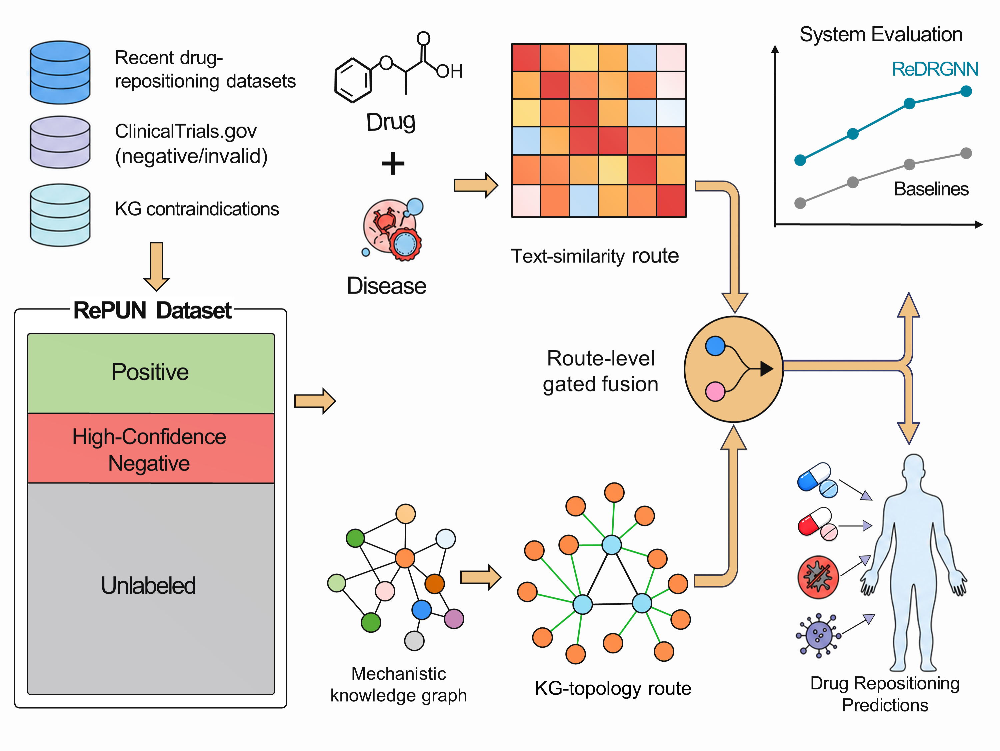
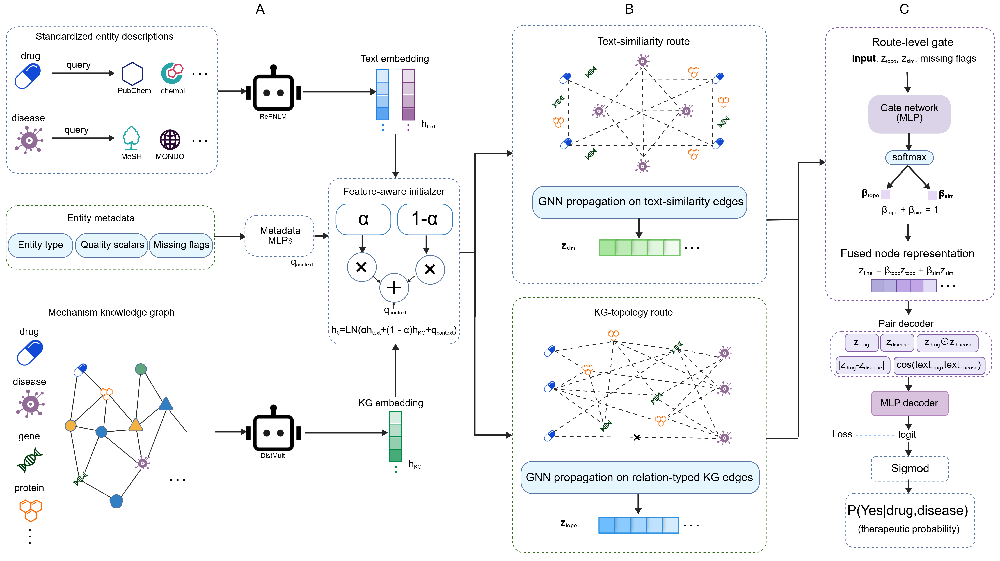

# ReDRGNN: A Negative-Enhanced Dual-Route Graph Neural Network for Drug Repositioning

ReDRGNN is a negative-enhanced dual-route graph neural network for drug
repositioning, released with its public training implementation and the RePUN
drug-disease association data.

## Project Overview



*Overview of negative-enhanced RePUN dataset construction, dual-route graph
learning, gated fusion, and drug-repositioning prediction.*

## Model Architecture



*ReDRGNN integrates feature-aware text and KG initialization,
text-similarity and KG-topology routes, route-level gated fusion, and pairwise
drug-disease decoding.*

## Data contract

RePUN files are headerless, three-column, tab-separated files:

```text
drug_name<TAB>disease_name<TAB>label
```

The label contract is strict:

| file            | allowed label | role                 |
| --------------- | ------------: | -------------------- |
| `RePUN-P.txt` |         `1` | supervised positives |
| `RePUN-N.txt` |         `0` | supervised negatives |
| `RePUN-U.txt` |        `-1` | unlabeled pairs      |
| `RePUN-T.txt` |  `0`, `1` | held-out Pub_Test    |

`RePUN-T` pairs are automatically removed from P/N before any split. Unknown
pairs are never passed to BCE and are never treated as negatives.

Auxiliary inputs are kept outside the RePUN dataset:

| file                            | role                                                             |
| ------------------------------- | ---------------------------------------------------------------- |
| `authority70_holdout.tsv`     | Authority70 pairs held out from training to prevent data leakage |
| `metadata/entity_quality.tsv` | Entity-level metadata used to construct node quality features    |

Pairs overlapping with Authority70 are removed from RePUN-P/N before data
splitting and are never used as training examples.

Processed external evaluation pairs are kept separately from RePUN:

| file                                 | positives | reliable negatives |
| ------------------------------------ | --------: | -----------------: |
| `external_evaluation/Fdataset.tsv` |     1,745 |              1,816 |
| `external_evaluation/Cdataset.tsv` |     2,282 |              2,648 |
| `external_evaluation/Ydataset.tsv` |     7,708 |              9,501 |

Fdataset, Cdataset, and Ydataset are used for evaluation by taking positive samples and reliable negatives, provided that they do not conflict with or duplicate the training set of ReDRGNN.

## Experimental environment

The reported ReDRGNN experiments were run in the following environment:

| component                     |  | specification                                      |
| ----------------------------- | - | -------------------------------------------------- |
| Operating system              |  | Ubuntu 22.04.3 LTS, Linux kernel 6.8.0-124-generic |
| CPU                           |  | Intel Core i9-7900X, 10 cores / 20 threads         |
| RAM                           |  | 128 GB (125 GiB available to the operating system) |
| GPU                           |  | 4 x NVIDIA GeForce RTX 3090, 24 GB each            |
| GPUs used per training run    |  | 1                                                  |
| NVIDIA driver                 |  | 595.71.05                                          |
| Driver-supported CUDA version |  | 13.2                                               |
| PyTorch CUDA runtime          |  | CUDA 13.0                                          |
| cuDNN                         |  | 9.19.0                                             |
| Python                        |  | 3.13.2G                                            |
| NumPy                         |  | 2.4.3                                              |
| PyTorch                       |  | 2.11.0+cu130                                       |

ReDRGNN does not depend on DGL or PyTorch Geometric. The host contains four
GPUs, but each seed is trained on a single selected GPU; the implementation is
not distributed or multi-GPU training.

## Install

Python 3.11 or newer is required.

Install the required dependencies and the ReDRGNN package::

```bash
python -m pip install -r requirements.txt -e .
```

## Train

Run five independent training and evaluation runs:

```bash
python scripts/train.py --config configs/final.toml
```

The command trains ReDRGNN with five random seeds and evaluates every trained
model on the same RePUN-T test set. Per-seed checkpoints and metrics are written
under `runs/seed_<seed>/`, and the five-seed mean and standard deviation are
reported in `runs/summary.json`.
